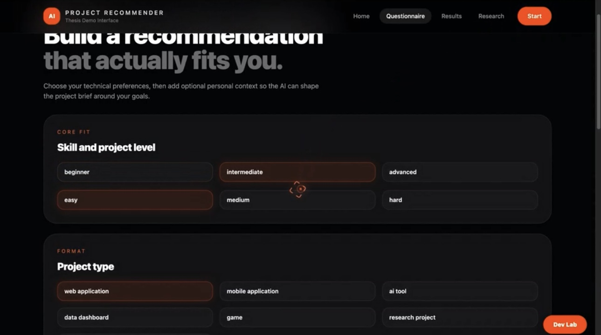
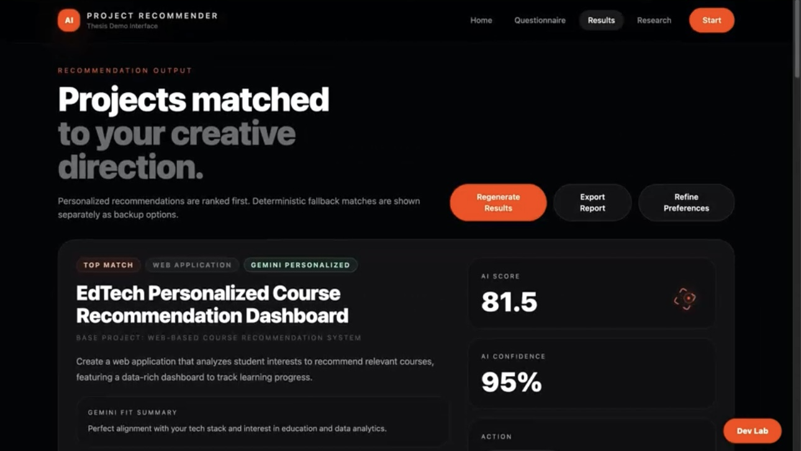
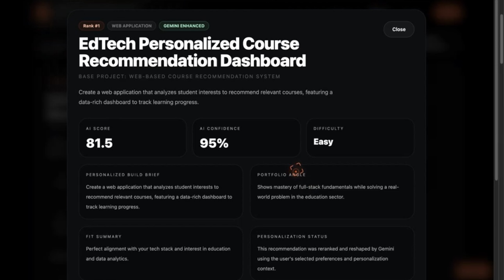
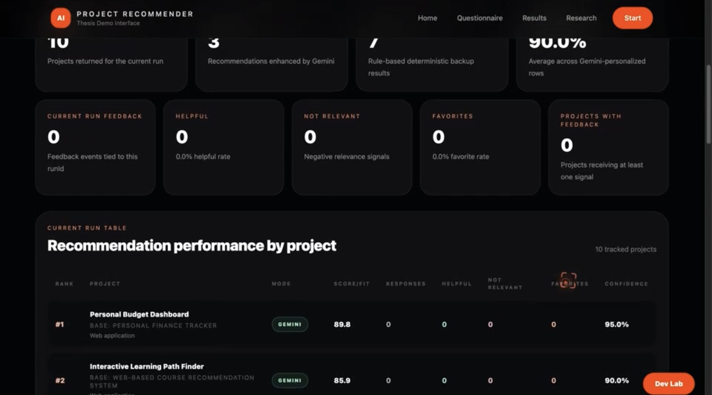

<div align="center">
# 🧠 AI Project Recommender
 
**A hybrid AI recommendation engine that matches students, creators, and learners with portfolio-worthy project ideas — personalized by Google Gemini and backed by a deterministic scoring engine.**
 
Built as a full-stack thesis demo (MERN + Gemini API)
 
</div>
<p align="center">
  
</p>
---
 
## ✨ Overview
 
**AI Project Recommender** helps users discover the right project to build next. A user answers a short questionnaire about their skill level, preferred tech stack, interests, and goals — the system then scores a dataset of projects deterministically, optionally re-ranks and personalizes the top candidates with **Gemini**, and returns a ranked list of recommendations with confidence scores, fit summaries, and a build brief for each.
 
It also ships with a full **Research / Evaluation Lab**: a password-protected developer dashboard for auditing the dataset, replaying test personas, inspecting Gemini vs. fallback performance, and tracking real user feedback per recommendation run.
 
## 🖼️ Preview
 
| Questionnaire | Results |
|---|---|
|  |  |
 
| Project Detail | Research Dashboard |
|---|---|
|  |  |
 
---
 
## 🚀 Features
 
- **Questionnaire-driven intake** — skill level, difficulty, project type, languages, interests, and optional personal context (portfolio goal, target industry, time available, build style).
- **Hybrid recommendation engine**
  - A deterministic scoring layer ranks the full project dataset against user preferences (skill match, tech alignment, interest fit).
  - The top candidates are sent to **Gemini** for reranking and personalization — generating a custom title, build brief, feature list, milestones, portfolio angle, and fit summary per project.
  - If Gemini is unavailable or fails, the system gracefully falls back to deterministic-only results so recommendations are never blocked.
- **Results dashboard** — ranked cards with AI score, AI confidence, difficulty, tech stack, and a "Gemini Personalized" vs. "Fallback" badge; expandable detail modal per project.
- **Feedback loop** — users can mark a recommendation as *Helpful*, *Not Relevant*, or a *Favorite*; feedback is tied to the exact `runId` for later analysis.
- **Report export** — generate a shareable report of a recommendation run.
- **Research Insights dashboard** — run-based analytics: total recommendations, Gemini vs. fallback split, average confidence, and per-project feedback performance.
- **Dev Lab** — token-protected admin area (password + signed access token) with:
  - **Dataset Editor** — view/edit/audit the project dataset
  - **Evaluation Lab** — replay saved test personas (e.g. *Beginner Web + JavaScript*, *Beginner AI + Python*, *Intermediate Mobile + Flutter*) against the live engine to sanity-check ranking quality
  - **Audit** — flags projects with missing fields or weak scoring
- **Recommendation run persistence** — every run is saved to MongoDB with the normalized preferences, full recommendation payload, and Gemini/fallback metadata for reproducibility.
## 🏗️ Architecture
 
```
┌─────────────────┐        POST /recommend        ┌──────────────────────┐
│   React Frontend │ ─────────────────────────────▶│   Express API        │
│  (Questionnaire,  │                                │                      │
│   Results, Dev    │◀───────────────────────────── │  1. Deterministic    │
│   Lab, Research)   │      ranked recommendations   │     scoring          │
└─────────────────┘                                │  2. Gemini rerank /  │
                                                     │     personalize     │
                                                     │  3. Fallback if AI  │
                                                     │     unavailable     │
                                                     │  4. Persist run     │
                                                     └──────────┬───────────┘
                                                                │
                                                        ┌───────▼────────┐
                                                        │    MongoDB     │
                                                        │  Projects,     │
                                                        │  Runs,         │
                                                        │  Feedback      │
                                                        └────────────────┘
```
 
**Scoring flow (`backend/services/hybridRecommender.js`):**
1. `scoreBaselineProjects` — deterministically scores every project against the user's skill, difficulty, tech, and interests.
2. `pickBaselineWindow` — shortlists the strongest candidates.
3. `buildHybridRecommendations` — sends the shortlist to the Gemini API for personalized reranking (custom title, brief, milestones, portfolio angle); on failure or timeout, deterministic scores are used as-is.
4. The API blends `deterministicScore` and `geminiScore` (45/55 weighting) into a final score, sorts Gemini-personalized results above fallback results, and persists the run.
## 🛠️ Tech Stack
 
**Frontend:** React 18 · React Router · Framer Motion · GSAP · Tailwind CSS
**Backend:** Node.js · Express 5 · Mongoose
**Database:** MongoDB
**AI:** Google Gemini API (configurable model + fallback model)
**Auth:** HMAC-signed access tokens for the Dev Lab
 
## 📁 Project Structure
 
```
AI-project-recommender-main/
├── backend/
│   ├── server.js                    # Express entry point
│   ├── models/                      # Project, RecommendationRun, RecommendationFeedback
│   ├── routes/                      # recommend, feedback, projects, devAuth, recommendationRuns
│   ├── services/
│   │   ├── hybridRecommender.js     # Deterministic scoring + Gemini personalization
│   │   ├── recommendationRunService.js
│   │   └── taxonomy.js
│   ├── scripts/                     # seed, audit, normalize, smoke test, expand dataset
│   └── data/targetedProjects.js     # Extended curated project dataset
├── frontend/
│   └── src/
│       ├── pages/                   # Home, Questionnaire, Results, Report,
│       │                            #   ResearchInsights, EvaluationLab, DatasetAudit, DatasetEditor
│       ├── components/              # ProjectCard, ProjectModal, ScoreBreakdown,
│       │                            #   RecommendationFeedbackBar, DevLabAccessModal, ...
│       └── utils/                   # api clients, taxonomy, evaluation runner/profiles
└── .env.example
```
 
## ⚙️ Getting Started
 
### Prerequisites
- Node.js (v18+)
- MongoDB running locally or a connection URI (e.g. MongoDB Atlas)
- A Gemini API key ([Google AI Studio](https://aistudio.google.com/))
### 1. Clone & configure environment
 
```bash
git clone https://github.com/BEZZARRANYA/AI-Project-Recommender-System.git
cd AI-Project-Recommender-System
cp .env.example .env
```
 
Fill in `.env`:
 
```env
PORT=5001
MONGO_URI=mongodb://127.0.0.1:27017/project_recommender
 
GEMINI_API_KEY=your_gemini_api_key
GEMINI_MODEL=gemini-3.1-flash-lite-preview
GEMINI_TIMEOUT_MS=35000
GEMINI_FALLBACK_MODEL=gemini-3-flash-preview
 
DEV_LAB_PASSWORD=choose_a_private_password
DEV_LAB_TOKEN_SECRET=choose_a_long_random_secret
 
REACT_APP_API_BASE_URL=http://127.0.0.1:5001
SMOKE_TEST_API_URL=http://127.0.0.1:5001
```
 
### 2. Install dependencies
 
```bash
# Backend
cd backend
npm install
 
# Frontend
cd ../frontend
npm install
```
 
### 3. Seed the project dataset
 
```bash
cd backend
npm run seed
```
 
### 4. Run the app
 
```bash
# Terminal 1 — backend (http://127.0.0.1:5001)
cd backend
npm start
 
# Terminal 2 — frontend (http://localhost:3000)
cd frontend
npm start
```
 
Visit `http://localhost:3000` and click **Start** to try the questionnaire.
 
## 🔌 API Reference
 
| Method | Endpoint | Description |
|---|---|---|
| `POST` | `/recommend` | Submit user preferences → returns ranked, persisted recommendations |
| `POST` | `/feedback` | Submit `helpful` / `not_relevant` / `favorite` feedback for a recommendation |
| `GET` | `/feedback/summary` | Aggregated feedback stats (optionally filtered by `runId`) |
| `GET` | `/feedback` | Raw recent feedback events |
| `GET` | `/projects` | List / audit the project dataset |
| `GET` | `/recommendation-runs` | Fetch saved recommendation runs |
| `POST` | `/dev-auth/unlock` | Exchange the Dev Lab password for a signed access token |
| `GET` | `/dev-auth/verify` | Verify a Dev Lab access token |
 
## 🧪 Backend Scripts
 
Run from `backend/`:
 
| Script | Purpose |
|---|---|
| `npm run seed` | Seed the initial project dataset |
| `npm run smoke` | Smoke-test the live API endpoints |
| `npm run cleanup:smoke` | Remove data generated by the smoke test |
| `npm run normalize:projects` | Normalize/clean project metadata |
| `npm run expand:projects` | Add the extended dataset of targeted projects |
| `npm run audit:projects` | Audit the dataset for missing fields / weak scoring |
 
## 🔬 Research & Evaluation
 
The **Research** tab shows run-based analytics for the current session (Gemini vs. fallback split, average confidence, feedback rates). The **Dev Lab** (unlocked with `DEV_LAB_PASSWORD`) additionally provides:
- **Evaluation Lab** — replay predefined test personas against the live recommender to catch ranking regressions
- **Dataset Audit** — surface projects with missing descriptions/learning paths or weak scores
- **Dataset Editor** — inspect and edit the project catalog directly
## 🗺️ Roadmap
 
- [ ] User accounts to save recommendation history across sessions
- [ ] Expand the curated dataset with community-submitted project ideas
- [ ] A/B test alternate Gemini prompt strategies against the deterministic baseline
- [ ] Public deployment (currently a local/thesis demo)
## 📄 License
 
This project was built as an academic thesis demo. Add a license of your choice (MIT recommended) if you plan to open it up for reuse.
 
## 🙋 Author
 
**Ranya Bezzar** — Computer Science graduate, Hubei University of Technology (HBUT)
GitHub: [@BEZZARRANYA](https://github.com/BEZZARRANYA)
 
